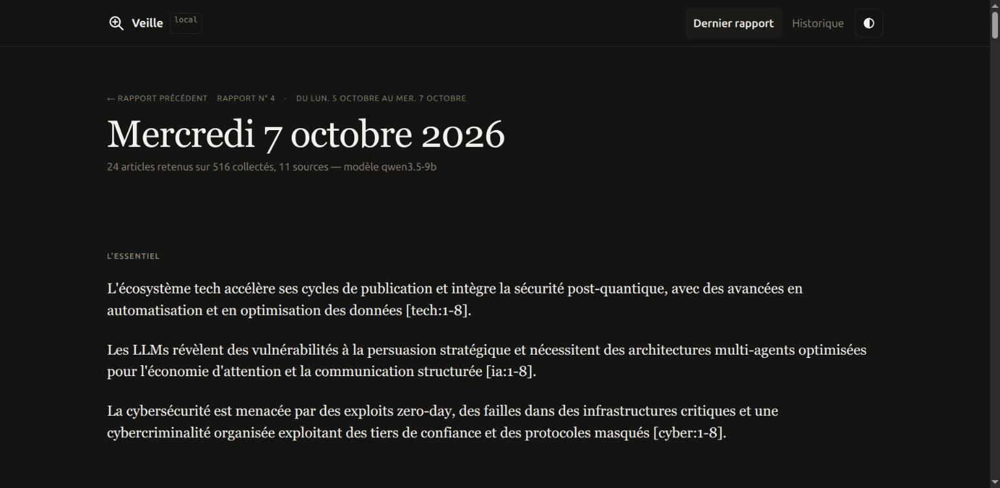
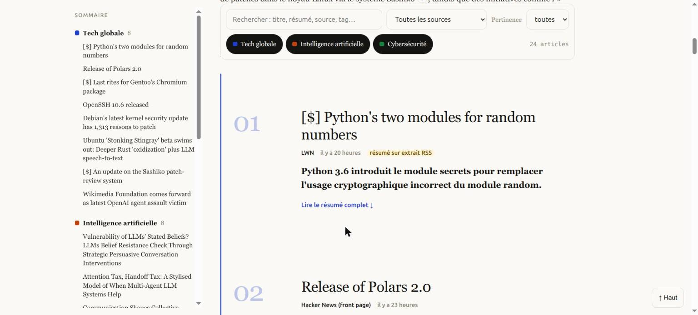

<div align="center">

# veille

**Veille technologique 100 % locale.** Des flux RSS à un rapport lisible, triés et résumés par un LLM qui tourne sur ta machine — rien ne sort du poste.

[](https://github.com/rom98759/llm_veille_tech/actions/workflows/ci.yml)
[](LICENSE)
[](pyproject.toml)




</div>

## Pourquoi

Les lecteurs RSS classiques entassent des centaines d'articles non lus. Les agrégateurs IA grand public envoient le contenu dans le cloud. **veille** fait le tri à la place de l'utilisateur, avec un LLM local (Ollama, llama.cpp, LM Studio, vLLM — n'importe quel serveur compatible OpenAI) : chaque article est jugé contre un profil d'intérêt défini en config, noté par une grille de critères (pas une note libre qui sature), résumé en 5-8 phrases, puis compilé en rapport HTML autonome avec synthèse par axe, citations traçables et historique interrogeable en SQLite.

Rien ne quitte la machine. Aucune clé API requise pour l'usage courant.

## Pipeline

```
 1. COLLECTE            2. TRI                          3. COMPILATION                4. RENDU
 flux RSS/Atom   ─►  dédup URL + regroupement     ─►  extraction texte (trafilatura) ─►  rapport .md / .html / .json
 par axe +           par sujet (multi-sources)         résumé JSON par article          (template Jinja commun)
 flux partagés       score heuristique                 synthèse par axe avec [n]        + latest.html
 routés par          (mots-clés × poids source         résumé exécutif tous axes
 mots-clés           × fraîcheur × couverture)
                     top N ─► LLM : grille
                     oui/non → note 0-10
            └──────────────── tout est stocké dans SQLite (data/veille.db) ────────────────┘
```

- **Sources utiles** : un flux a un `weight` ; un sujet repris par plusieurs sources est boosté ; le LLM juge chaque candidat par rapport au `profile` défini dans la config. Seuls les articles ≥ `min_llm_score` sont résumés.
- **Notation par grille** : une note libre 0-10 sature avec les petits modèles (test réel : 18/18 entre 8 et 10). Le LLM répond donc à des questions fermées — dans l'axe ? fait nouveau ? concret ? actionnable ? impact large ? bruit/marketing ? — et la note est calculée en Python (`process.JUDGE_WEIGHTS`). Les critères validés s'affichent sur chaque fiche.
- **Économie de LLM** : le pré-tri heuristique limite à `candidates_per_axis` appels de notation par axe ; notes et résumés sont mis en cache en base, **par modèle et version de prompt** (changer `llm.model` régénère tout) ; appels en parallèle (`llm.max_workers`).
- **Provenance** : si la page ne peut pas être lue, le résumé est fait sur l'extrait du flux — c'est signalé dans le log et sur la fiche (« résumé sur extrait RSS »).
- **Traçabilité** : chaque affirmation de synthèse cite `[n]` → ancre vers la fiche article → lien source. Les candidats écartés sont listés avec leur note et la raison (« Autres liens évalués »). L'historique complet reste interrogeable.

## Installation

```bash
python -m venv .venv && . .venv/bin/activate
pip install -e .
cp config.example.yaml config.yaml     # définir axes, flux, profil, modèle

# LLM local (exemple Ollama)
ollama pull qwen3:8b
```

Installation reproductible (versions testées) : `pip install -r requirements.lock && pip install --no-deps -e .`

Tout serveur compatible OpenAI fonctionne (`llm.base_url`) : Ollama, llama.cpp `llama-server`, LM Studio, vLLM.

### Choix du modèle

| Taille | Constat | Usage |
|---|---|---|
| 3-4B (ex. `qwen3-4b`, `qwen3.5-4b`) | **Testé** : rapide (≤ 2 s/appel sur GPU modeste), mais la notation sature régulièrement à 10/10 — le tri perd son intérêt | machine sans GPU, ou simple résumé sans tri fin |
| 7-9B (ex. `qwen3.5-9b`) | **Testé** : meilleure discrimination des notes sur certains axes, mais inconsistant (un axe peut quand même saturer), 3× plus lent qu'un MoE équivalent | compromis correct si la RAM est le facteur limitant |
| 30B+ en MoE (ex. `qwen3-30b-a3b`) | **Testé** : nette discrimination des notes, rapide (peu de paramètres actifs par token malgré la taille totale) | recommandé si la RAM suit — le fichier complet doit tenir en mémoire même en MoE |
| Cloud (API compatible OpenAI) | Pas de limite matérielle, résultat quasi instantané | si la contrainte « 100 % local » n'est pas absolue ; pointer `llm.base_url` vers le fournisseur, clé API en variable d'environnement |

- Modèles « raisonnants » (qwen3…) : le bloc `<think>` renvoyé est retiré automatiquement ; pour le couper à la source et gagner du temps, `llm.extra_body` (ex. `{reasoning_effort: none}`) ou `--reasoning off` côté serveur selon le backend.
- Parallélisme : `llm.max_workers` n'accélère que si le serveur traite plusieurs requêtes en parallèle (`n_slots` côté llama.cpp, `OLLAMA_NUM_PARALLEL` côté Ollama).
- `veille -v report` logge chaque requête/réponse complète et les tokens/s réels (extension `timings` de llama.cpp) — utile pour auditer ou comparer des modèles.

## Utilisation

```bash
veille collect                 # récupère les flux (à lancer souvent, ex. toutes les 2 h)
veille report                  # trie + résume + génère reports/veille-<date>.{md,html,json}
veille run                     # collect + report
veille run --axis cyber        # un seul axe

# Creuser : recherche dans tout l'historique collecté
veille links kubernetes --days 30
veille links --axis cyber --min-score 7

veille prune --older-than 90   # purge des vieux articles (les rapports gardent leur JSON)
veille export-opml --out feeds.opml   # flux au format OPML (Miniflux, FreshRSS…)
```

Sorties dans `reports/` : `veille-<date>.html` (autonome, aucune ressource externe, ouvrable en `file://`), `.md`, `.json`, plus `index.html` (historique de tous les rapports), `latest.html` (redirige vers le dernier) et `latest.json`.

Le rapport HTML est pensé pour **donner envie de lire** : chaque fiche met en avant le **titre** et une **accroche**, le résumé complet (5-8 phrases), les points clés et « pourquoi c'est important » restent repliés par défaut (`<details>` natif, un clic pour tout voir, lien direct vers la source). La note de pertinence ne s'affiche plus — elle reste trop bruitée avec un petit modèle pour servir à la lecture, elle continue de piloter le tri en coulisses.
Autour : bloc « L'essentiel » (résumé exécutif avec renvois vers les fiches), synthèse par axe avec citations `[n]` cliquables, couleur par axe, sommaire fixe, recherche et filtres (source, pertinence, axe, clic sur un tag), liens écartés avec la raison, navigation vers le rapport précédent, thème clair/sombre, impression propre, responsive mobile/desktop. Typographie serif/sans système (aucune ressource externe chargée).

### Vérifier les sources (à faire en premier)

```bash
veille check-feeds                                   # sources de config.yaml
veille check-feeds --catalog sources/catalog.yaml --out reports/sources.md   # ~80 sources candidates
veille check-feeds --catalog sources/catalog.yaml --group cyber_fr
veille discover cyberveille.esante.gouv.fr next.ink  # trouver le flux d'un site
```

Chaque source est réellement téléchargée et parsée avec le même code que la collecte :

| Verdict | Signification |
|---|---|
| ✅ OK | flux valide, articles avec titre + lien, dernier article < 30 j (`--stale-days`) |
| 💤 INACTIF | flux valide mais plus alimenté |
| 🔎 PAGE HTML | l'URL est une page, pas un flux — les flux déclarés par la page sont proposés |
| ⚠️ VIDE | flux lisible mais aucun article exploitable |
| ❌ ERREUR | 403 (anti-bot/Cloudflare), 404, 429, timeout, DNS… |

`sources/catalog.yaml` : sources par thème (agrégateurs, tech, tech FR, IA, recherche, cyber, cyber FR, homelab, releases GitHub) avec une note `web` (URL confirmée par recherche) ou `à tester`. Copier les ✅ utiles dans `config.yaml`.

Points connus :
- **CISA** a retiré ses flux RSS (mai 2025) → source `kind: cisa_kev` qui lit le catalogue JSON des vulnérabilités activement exploitées.
- **Anthropic** n'a pas de flux officiel → flux communautaires (GitHub) dans le catalogue.
- **Hugging Face** : items sans `<link>` → repli automatique sur `<guid>`.
- **Reddit** : `www.reddit.com/r/<sub>/.rss` fonctionne, `old.reddit.com` exige un login ; 403/429 intermittents selon l'IP et le moment, pas un bug — géré par retry + warning.
- **Phoronix, Cloudflare** : protection anti-bot, 403 fréquents depuis des IP de datacenter (moins depuis une IP résidentielle).

### Planification

cron :
```
0 */2 * * *  cd /opt/llm_veille_tech && .venv/bin/veille collect
30 7 * * *   cd /opt/llm_veille_tech && .venv/bin/veille report
```

Docker :
```bash
docker compose up -d ollama web
docker compose exec ollama ollama pull qwen3:8b
docker compose run --rm veille run      # avec base_url: http://ollama:11434/v1
# rapports : http://<lab>:8080/  (index.html = historique)
```

## Ajouter un axe

Dans `config.yaml`, sous `axes:` :

```yaml
  homelab:
    title: Homelab & self-hosting
    description: Proxmox, NAS, réseau, domotique.
    keywords: [proxmox, truenas, homelab, self-hosted, opnsense, wireguard]
    feeds:
      - {name: r/selfhosted, url: "https://www.reddit.com/r/selfhosted/top/.rss?t=day"}
```

`keywords` sert au pré-tri et au routage des `shared_feeds` (HN, Lobsters…) ; `description` est donnée au LLM pour juger la pertinence.
Sources sans RSS : beaucoup de sites en ont un caché (`/feed`, `/rss`, `/atom.xml`) ; sinon [RSS-Bridge](https://github.com/RSS-Bridge/rss-bridge) auto-hébergé, ou `hnrss.org`, `reddit.com/r/<sub>/.rss`, chaînes YouTube (`/feeds/videos.xml?channel_id=`), releases GitHub (`/<owner>/<repo>/releases.atom`).

## Personnaliser

- Rapport : `veille/templates/report.html.j2` (HTML rendu directement depuis les données), `_theme.css` (couleurs, typo), `report.md.j2` (export texte), `index.html.j2` (historique).
- Prompts : `veille/prompts.py` ; poids de la grille : `JUDGE_WEIGHTS` dans `veille/process.py`. Modifier un prompt → incrémenter `JUDGE_VERSION` / `SUMMARY_VERSION` pour invalider le cache.
- Données brutes pour analyse : `sqlite3 data/veille.db` — tables `articles` (texte complet, résumé JSON), `article_axes` (notes par axe), `reports` (JSON de chaque rapport).

## Développement

```bash
make install   # dépendances figées + ruff + pytest + hook pre-commit
make check     # lint + format + tests (identique à la CI)
```

Conventions (branches, Conventional Commits, changelog) : [CONTRIBUTING.md](CONTRIBUTING.md). Historique des versions : [CHANGELOG.md](CHANGELOG.md).

## À propos

Projet personnel, construit avec l'aide d'un assistant IA (Claude) en pair-programming — architecture, décisions et tests validés manuellement à chaque étape, pas de génération en pilote automatique. Licence [MIT](LICENSE).
