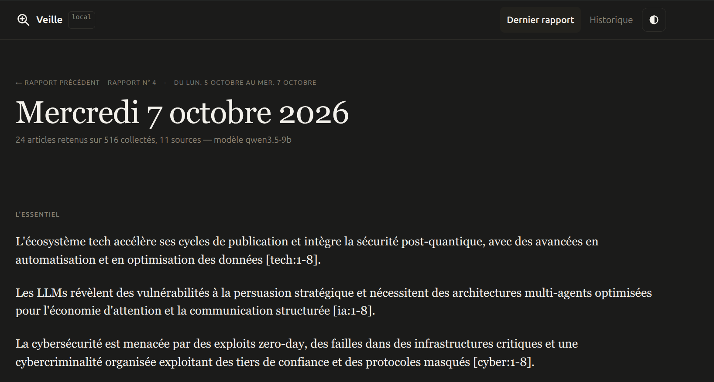
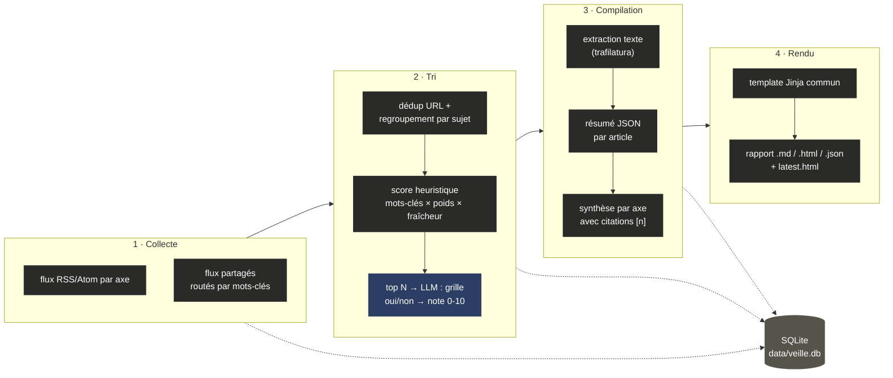
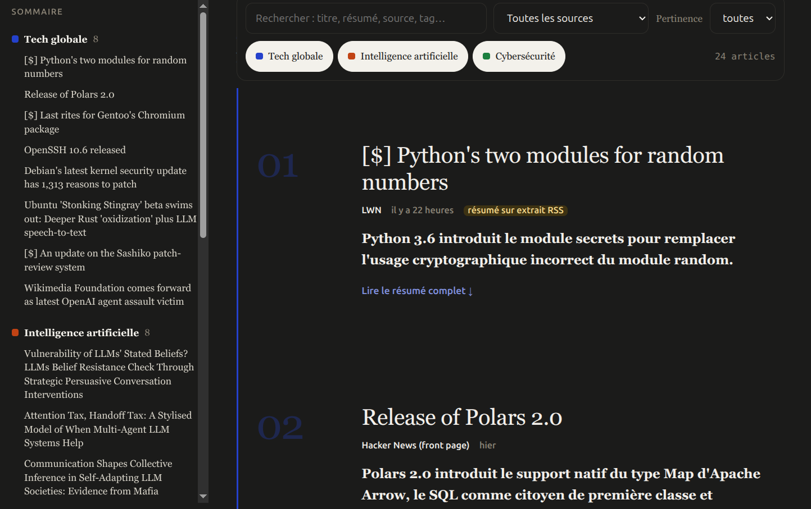
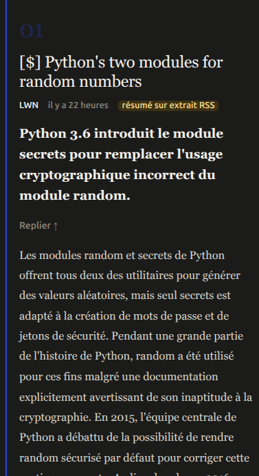

<div align="center">

# veille

**Veille technologique 100 % locale.** Des flux RSS à un rapport lisible, triés et résumés par un LLM qui tourne sur ta machine — rien ne sort du poste.

[](https://github.com/rom98759/llm_veille_tech/actions/workflows/ci.yml)
[](LICENSE)
[](pyproject.toml)

<br>



</div>

`RÉF. 00 — rapport complet, thème sombre, généré localement`

## 01 · Pourquoi

Les lecteurs RSS classiques entassent des centaines d'articles non lus. Les agrégateurs IA grand public envoient le contenu dans le cloud.

**veille** fait le tri à la place de l'utilisateur, avec un LLM qui tourne en local :

- chaque article est jugé contre un **profil d'intérêt** défini en config, pas un prompt générique
- noté par une **grille de critères** (dans l'axe ? fait nouveau ? actionnable ?) — pas une note libre, qui sature avec les petits modèles
- résumé en 5-8 phrases, avec points clés et « pourquoi c'est important »
- compilé en un **rapport HTML autonome** : synthèse par axe, citations traçables `[n]`, historique interrogeable en SQLite

Rien ne quitte la machine. Aucune clé API requise pour l'usage courant.

## 02 · Pipeline



- **Sources utiles** : un flux a un `weight` ; un sujet repris par plusieurs sources est boosté ; le LLM juge chaque candidat par rapport au `profile` défini dans la config. Seuls les articles ≥ `min_llm_score` sont résumés.
- **Notation par grille** : une note libre 0-10 sature avec les petits modèles (test réel : 18/18 entre 8 et 10). Le LLM répond donc à des questions fermées, et la note est calculée en Python (`process.JUDGE_WEIGHTS`). Les critères validés s'affichent sur chaque fiche.
- **Économie de LLM** : le pré-tri heuristique limite à `candidates_per_axis` appels de notation par axe ; notes et résumés sont mis en cache en base, **par modèle et version de prompt** ; appels en parallèle (`llm.max_workers`).
- **Provenance** : si la page ne peut pas être lue, le résumé est fait sur l'extrait du flux — signalé dans le log et sur la fiche.
- **Traçabilité** : chaque affirmation de synthèse cite `[n]` → ancre vers la fiche article → lien source. Les candidats écartés sont listés avec leur note et la raison. L'historique complet reste interrogeable.

## 03 · Aperçu




`RÉF. 01 — fiche dépliée, desktop`   ·   `RÉF. 02 — même fiche, mobile`

Résumé complet et points clés repliés par défaut (`<details>` natif, un clic pour tout voir). Thème clair/sombre synchronisé avec les préférences système. La note de pertinence ne s'affiche plus — trop bruitée avec un petit modèle pour servir à la lecture — mais continue de piloter le tri en coulisses.

## 04 · Installation

```bash
python -m venv .venv && . .venv/bin/activate
pip install -e .
cp config.example.yaml config.yaml     # définir axes, flux, profil, modèle

# LLM local (exemple Ollama)
ollama pull qwen3:8b
```

Installation reproductible (versions testées) : `pip install -r requirements.lock && pip install --no-deps -e .`

Tout serveur compatible OpenAI fonctionne (`llm.base_url`) : Ollama, llama.cpp `llama-server`, LM Studio, vLLM.

### Choix du modèle

| Taille | Constat | Usage |
|---|---|---|
| 3-4B (ex. `qwen3-4b`, `qwen3.5-4b`) | **Testé** : rapide (≤ 2 s/appel sur GPU modeste), mais la notation sature régulièrement à 10/10 — le tri perd son intérêt | machine sans GPU, ou simple résumé sans tri fin |
| 7-9B (ex. `qwen3.5-9b`) | **Testé** : meilleure discrimination des notes sur certains axes, mais inconsistant, 3× plus lent qu'un MoE équivalent | compromis correct si la RAM est le facteur limitant |
| 30B+ en MoE (ex. `qwen3-30b-a3b`) | **Testé** : nette discrimination des notes, rapide (peu de paramètres actifs par token malgré la taille totale) | recommandé si la RAM suit — le fichier complet doit tenir en mémoire même en MoE |
| Cloud (API compatible OpenAI) | Pas de limite matérielle, résultat quasi instantané | si la contrainte « 100 % local » n'est pas absolue ; pointer `llm.base_url` vers le fournisseur, clé API en variable d'environnement |

- Modèles « raisonnants » (qwen3…) : le bloc `<think>` renvoyé est retiré automatiquement ; pour le couper à la source, `llm.extra_body` (ex. `{reasoning_effort: none}`) ou `--reasoning off` côté serveur selon le backend.
- Parallélisme : `llm.max_workers` n'accélère que si le serveur traite plusieurs requêtes en parallèle (`n_slots` côté llama.cpp, `OLLAMA_NUM_PARALLEL` côté Ollama).
- `veille -v report` logge chaque requête/réponse complète et les tokens/s réels — utile pour auditer ou comparer des modèles.

## 05 · Utilisation

```bash
veille collect                 # récupère les flux (à lancer souvent, ex. toutes les 2 h)
veille report                  # trie + résume + génère reports/veille-<date>.{md,html,json}
veille run                     # collect + report
veille run --axis cyber        # un seul axe

# Creuser : recherche dans tout l'historique collecté
veille links kubernetes --days 30
veille links --axis cyber --min-score 7

veille prune --older-than 90   # purge des vieux articles (les rapports gardent leur JSON)
veille export-opml --out feeds.opml   # flux au format OPML (Miniflux, FreshRSS…)
```

Sorties dans `reports/` : `veille-<date>.html` (autonome, aucune ressource externe, ouvrable en `file://`), `.md`, `.json`, plus `index.html` (historique), `latest.html` et `latest.json`.

Autour : bloc « L'essentiel », synthèse par axe avec citations cliquables, sommaire fixe, recherche et filtres, liens écartés avec leur raison, navigation entre rapports, impression propre.

### Vérifier les sources (à faire en premier)

```bash
veille check-feeds                                   # sources de config.yaml
veille check-feeds --catalog sources/catalog.yaml --out reports/sources.md   # ~80 sources candidates
veille discover cyberveille.esante.gouv.fr next.ink  # trouver le flux d'un site
```

| Verdict | Signification |
|---|---|
| `OK` | flux valide, articles avec titre + lien, dernier article < 30 j |
| `INACTIF` | flux valide mais plus alimenté |
| `PAGE HTML` | l'URL est une page, pas un flux — les flux déclarés par la page sont proposés |
| `VIDE` | flux lisible mais aucun article exploitable |
| `ERREUR` | 403 (anti-bot/Cloudflare), 404, 429, timeout, DNS… |

`sources/catalog.yaml` : ~80 sources par thème avec une note `web` (confirmée) ou `à tester`. Détails sources connues (CISA, Reddit, Hugging Face…) : voir [llms.txt](llms.txt).

### Planification

```bash
# cron
0 */2 * * *  cd /opt/llm_veille_tech && .venv/bin/veille collect
30 7 * * *   cd /opt/llm_veille_tech && .venv/bin/veille report
```

```bash
# Docker
docker compose up -d ollama web
docker compose exec ollama ollama pull qwen3:8b
docker compose run --rm veille run      # avec base_url: http://ollama:11434/v1
```

## 06 · Personnaliser

- **Ajouter un axe** : dans `config.yaml`, sous `axes:` — voir [llms.txt](llms.txt) pour un exemple complet.
- **Rapport** : `veille/templates/report.html.j2`, `_theme.css`.
- **Prompts** : `veille/prompts.py` ; poids de la grille : `JUDGE_WEIGHTS` dans `veille/process.py`.
- **Données brutes** : `sqlite3 data/veille.db` — tables `articles`, `article_axes`, `reports`.

## 07 · Développement

```bash
make install   # dépendances figées + ruff + pytest + hook pre-commit
make check     # lint + format + tests (identique à la CI)
```

Conventions : [.github/CONTRIBUTING.md](.github/CONTRIBUTING.md) · Historique : [docs/CHANGELOG.md](docs/CHANGELOG.md) · Vue d'ensemble pour agents IA : [llms.txt](llms.txt)

## 08 · À propos

Projet personnel, construit avec l'aide d'un assistant IA (Claude) en pair-programming — architecture, décisions et tests validés manuellement à chaque étape, pas de génération en pilote automatique. Licence [MIT](LICENSE).
